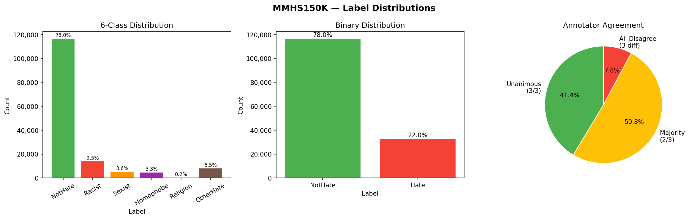
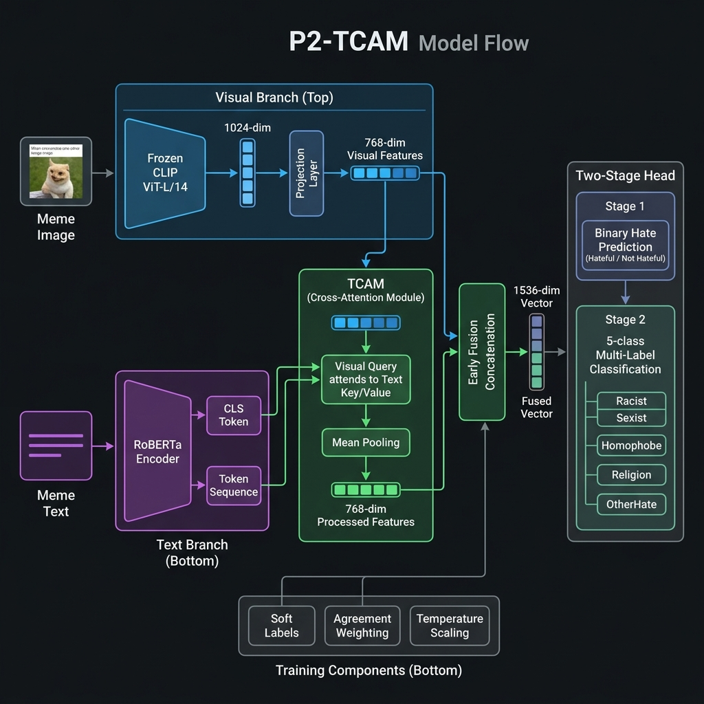
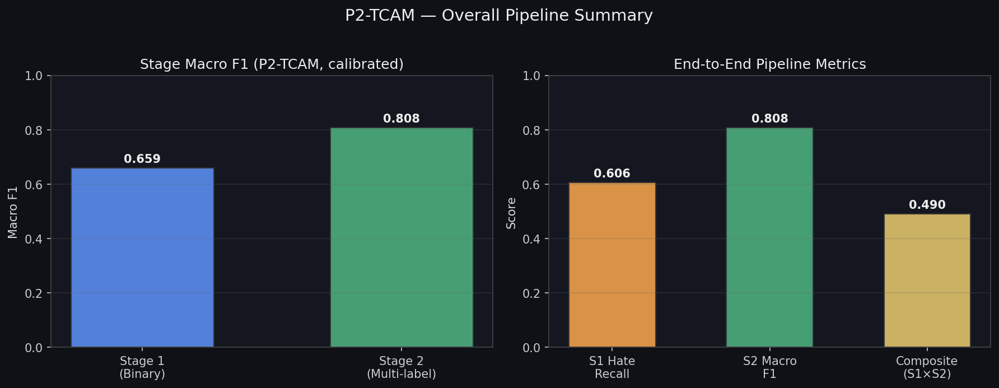

# Memes Vibe Classifier

Hello! This is my project — an attempt to tackle **MMHS150K**, one of the largest multimodal hate-speech datasets out there (~150k tweet + image pairs). The goal is simple to state and hard to get right: look at a meme (image + text), decide whether it is hateful, and if it is, figure out *what kind* of hate it is.

Most work on this dataset stops at a single binary head. I built a full **two-stage pipeline** so Stage 2 is not an afterthought — once something is flagged as hate, a second specialist head predicts the fine-grained type(s).

---

## The problem

Memes are multimodal by nature. The tweet text might be harmless on its own, and the image might look innocent alone. Together they can form a racist joke, a sexist punchline, or something subtler. A model has to reason over **both** modalities at once.

MMHS150K makes that even harder:

| Challenge | What I saw in the data |
|---|---|
| Class imbalance | ~78–83% NotHate; Religion is ~0.1–0.2% of labels |
| Annotator noise | Only ~41–44% of samples have unanimous hate/not-hate agreement; a large chunk is 2/3 majority |
| Multi-label types | A meme can be Racist **and** Sexist at the same time |
| Accuracy is misleading | Always predicting NotHate looks “good” on accuracy and fails the actual task |

So I report **macro F1**, hate recall / AUC for Stage 1, and multi-label macro / micro F1 for Stage 2 — not accuracy alone.



---

## What I built

### Two-stage setup (Variation D)

```
meme image + (tweet | OCR | caption)
              │
              ▼
     ┌────────────────────┐
     │  Multimodal encoder │  (P2-TCAM, or Stage-1 stack)
     └─────────┬──────────┘
               │
       Stage 1 │  binary: Hate vs NotHate
               │
         if Hate
               │
       Stage 2 │  multi-label: Racist, Sexist, Homophobe, Religion, OtherHate
```

- **Stage 1** is the bottleneck. If it misses a hateful meme, Stage 2 never sees it.
- **Stage 2** only trains on hateful samples and can fire multiple type labels at once.
- End-to-end I track a simple composite:  
  **Composite = Stage-1 hate recall × Stage-2 macro F1**  
  Stage 2 can clean up Stage-1 false positives (it can output all-zeros on types), but it **cannot** recover Stage-1 false negatives.

### Main architecture — P2-TCAM

**P2-TCAM** (Text-guided Cross-Attention Multimodal) is the primary full pipeline:

| Branch | Backbone | Role |
|---|---|---|
| Vision | Frozen **CLIP ViT-L/14** | Image patch tokens → projected to 768-d |
| Text | **TweetEval RoBERTa** (last layers unfrozen) | Tweet + OCR (+ optional caption) |
| Fusion | **TCAM** cross-attention | Visual queries attend to text keys/values, then mean-pool |
| Heads | Early fusion (1536-d) → Stage 1 + Stage 2 | Binary then 5-way multi-label |



Training tricks that actually mattered on this noisy set:

- Soft / hard label recipes and class **pos_weight** for imbalance  
- Agreement-aware loss weighting when annotators disagree  
- Temperature scaling + **threshold sweep** on val (default 0.5 is a bad fit for ~80% NotHate)  
- Per-category Stage-2 thresholds (e.g. Racist ~0.50, Sexist / Homophobe / Religion ~0.80)

I also ran an older **P7 MHSDF**-style baseline and a dedicated **Stage-1 improvement stack** (full fine-tune text models, a Hate-CLIPper-style align fusion port, Qwen3-VL LoRA, and probability ensembling) to push the binary gate without rewriting Stage 2.

---

## Results

### Full P2-TCAM pipeline (Variation D, `all_text`)

Numbers from the trained two-stage run (val, calibrated Stage-2 thresholds):

| Stage | Task | Metric | Score |
|---|---|---|---|
| Stage 1 | Hate vs NotHate | Macro F1 | **0.659** |
| Stage 1 | Hate vs NotHate | Hate recall | **0.606** |
| Stage 2 | 5-type multi-label | Macro F1 (calibrated) | **0.809** |
| Stage 2 | 5-type multi-label | Micro F1 | **0.867** |
| End-to-end | S1 recall × S2 macro F1 | Composite | **0.490** |

Stage 2 per-class F1 (calibrated):

| Racist | Sexist | Homophobe | Religion | OtherHate |
|---|---|---|---|---|
| 0.924 | 0.743 | 0.907 | 0.667 | 0.803 |

Religion stays the hardest class — there simply are almost no training examples. Racist / Homophobe are where the multimodal signal is strongest.



Stage 2 is clearly the stronger half of the system once hate is detected — the composite is limited mainly by Stage-1 hate recall.

### Stage-1 push (binary only)

After more Stage-1 ablations on an A6000:

| Model | Macro F1 (approx.) | AUC (approx.) |
|---|---|---|
| Text — `hate-latest` | ~0.662 | ~0.706 |
| Text — TweetEval RoBERTa | ~0.660 | ~0.703 |
| Hate-CLIPper-style (align + adapters) | competitive with text | — |
| Soft-label recipes (S0–S5) | best ~0.666 (hard + pos_weight) | — |
| Ensemble of full-val members | ~0.667 | ~0.709 |

VLM LoRA helped less than pure text / CLIP fusion on this set. Soft labels alone did not magically break the noise ceiling; hard labels with proper class weighting stayed surprisingly strong.

---

## How this compares on MMHS150K

Published numbers on MMHS150K are messy (different splits, accuracy vs F1, binary-only vs 6-class), but the ballpark is consistent:

- Early Gomez et al. unimodal / simple-fusion baselines sit roughly in the **mid–high 0.5s** F1 range; multimodal fusion helps over text-only, but not by a huge margin once labels are noisy.
- A lot of later binary work lands around **0.55–0.65 macro F1**.
- Stronger modern methods (better CLIP fusion, contrastive / retrieval-style losses, prompting) often claim around **~0.70** binary macro F1; almost nobody honestly clears ~0.72 when the metric is strict macro F1 under heavy annotator disagreement.

My Stage-1 scores (~**0.66–0.67** macro F1, AUC ~**0.71**) sit in the **competitive middle / upper-mid** of that literature range — not SOTA, not a weak baseline. The more interesting part for me is Stage 2: once hate is isolated, type classification reaches **~0.81 macro / ~0.87 micro F1**, which is where the hierarchical design pays off. Most papers never report that second stage cleanly.

The ceiling analysis is blunt: more than half the binary labels are majority-vote ambiguous. Beyond a point you are modeling annotator noise, not “true” hate.

---

## Repo layout (high level)

```
src/
  p2/                 # P2-TCAM two-stage model + trainer
  p7/                 # MHSDF-style baseline
  stage1/             # shared Stage-1 data / eval / soft recipes
  s1_text/            # full fine-tune text Stage-1
  hateclipper_mmhs/   # Hate-CLIPper-style port for MMHS
  s1_vlm/             # Qwen3-VL LoRA Stage-1
  data/ evaluation/   # preprocessing, metrics, splits
scripts/              # train / eval / remote Stage-1 runners
notebooks/            # exploratory + Kaggle training notebooks
assets/               # figures used in this README
configs/              # default track config
```

Weights, the full dataset, and bulky result dumps stay out of git (see `.gitignore`).

---

## Future work

If I push this further, the next real lever is less “train longer on the same BCE” and more **representation learning under noise**:

- **RGCL-style retrieval / contrastive losses** (as in RGCL-HateCLIPper-type work) — align same-class multimodal embeddings and pull hard negatives, which tends to help when labels are soft and sparse.
- Better OCR / caption quality filtering, and rethinking Religion as almost a few-shot problem.
- Calibrating the Stage-1 threshold for composite score (maximize hate recall without drowning Stage 2 in junk), not only Stage-1 macro F1 in isolation.

---

## Dataset & references

- **Dataset:** [MMHS150K](https://gombru.github.io/2019/10/09/MMHS/) — Gomez et al., *Exploring Hate Speech Detection in Multimodal Publications* (WACV 2020)
- **Related ideas:** Hate-CLIPper (cross-modal CLIP fusion), MemeCLIP-style adapters, RGCL-style contrastive multimodal hate detection

---

Built as my Deep Learning end-sem project attempt at a noisy, imbalanced, real-world multimodal hate-speech benchmark — with Stage 2 treated as first-class, not a footnote.
